# Juris Desk+ — Master Documentation

**Product:** Juris Desk+ — Enterprise Legal Practice Management Platform  
**Version:** 1.0  
**Status:** Design Phase  
**Owner:** BA/UX Lead  
**Jurisdiction:** Republic of the Philippines  
**Deployment:** Multi-tenant SaaS  
**Last Updated:** 2025-01-XX

---

## Table of Contents

1. [Product Overview](#1-product-overview)
2. [Business Requirements](#2-business-requirements)
3. [Scope](#3-scope)
4. [Compliance (PH)](#4-compliance-ph)
5. [Users & Roles](#5-users--roles)
6. [Role-Permission Matrix](#6-role-permission-matrix)
7. [Personas](#7-personas)
8. [Matter Types](#8-matter-types)
9. [Billing Types](#9-billing-types)
10. [User Flows](#10-user-flows)
11. [Sitemap / IA](#11-sitemap--ia)
12. [Wireframes](#12-wireframes)
13. [Form Specifications](#13-form-specifications)
14. [Design System](#14-design-system)
15. [Microcopy](#15-microcopy)
16. [Accessibility](#16-accessibility)
17. [Functional Requirements](#17-functional-requirements)
18. [Non-Functional Requirements](#18-non-functional-requirements)
19. [Integrations](#19-integrations)
20. [Data Model](#20-data-model)
21. [Seed Data](#21-seed-data)
22. [Demo Script](#22-demo-script)
23. [MVP vs Phase 2](#23-mvp-vs-phase-2)
24. [Success Metrics](#24-success-metrics)
25. [Risks & Mitigations](#25-risks--mitigations)
26. [Assumptions & Constraints](#26-assumptions--constraints)
27. [Open Questions](#27-open-questions)
28. [Approval & Change Log](#28-approval--change-log)

---

## 1. Product Overview

Juris Desk+ is an end-to-end, multi-tenant SaaS platform for Philippine law firms. It centralizes client intake, conflict checking, matter management, document workflows, time tracking, billing, trust accounting, approvals, and records retention.

**Core characteristics:**
- Internal-only (no client portal in MVP)
- Role-based, matter-centric, permission-aware
- Audit-ready and compliance-driven
- PH-jurisdiction compliant (CPRA, RA 10173, SC rules)

---

## 2. Business Requirements

| # | Goal | Success Metric |
|---|------|----------------|
| 1 | Centralize firm operations | 90% of matters tracked in-platform within 90 days |
| 2 | Reduce missed deadlines | Zero missed court deadlines from system gap |
| 3 | Improve billable-hour capture | +15% billable hours vs. baseline |
| 4 | Speed up billing cycle | Invoice sent within 7 days of cut-off |
| 5 | Enforce confidentiality | Zero unauthorized access incidents |
| 6 | Enable compliance audits | Full audit log retrievable in < 60s |
| 7 | Support multi-firm SaaS | Onboard new firm tenant in < 1 day |

---

## 3. Scope

### In Scope (MVP)
Multi-tenant SaaS foundation, RBAC, users/roles, client intake + duplicate check, conflict check + consent, matter management (10 types), contacts directory, document upload/versioning/approval, tasks, calendar, deadline engine, time tracking (billable/non-billable/pro bono), expenses, billing (5 types), invoicing, trust accounting with 3-way reconciliation, approvals inbox, reports & dashboards, audit log, notifications, data privacy tooling.

### Out of Scope (MVP)
Client portal, e-filing, AI document review, native mobile app, e-discovery, e-signature, payment gateway, advanced BI, workflow builder.

### Phase 2+
Client portal, e-filing (eCourt/e-Subpoena), e-signature, payment gateway, AI-assisted drafting, mobile app, advanced BI, workflow builder, multi-language, notarial register automation.

---

## 4. Compliance (PH)

### 4.1 Legal Framework

| Framework | Law / Rule | Relevance |
|-----------|------------|-----------|
| CPRA | Code of Professional Responsibility and Accountability (2023) | Ethics, conflict, trust, confidentiality |
| Data Privacy Act | RA 10173 (2012) | Personal data protection, NPC compliance |
| Rules of Court | Rule 13, Rule 22, Rule 141 | Filing, service, computation of time, fees |
| Notarial Rules | 2004 Rules on Notarial Practice | Register, commissions |
| IBP Rules | Integrated Bar of the Philippines | Membership, MCLE |
| AMLA | RA 9160 (as amended) | KYC, STR/CTR |
| eCommerce Act | RA 8792 | Electronic documents & signatures |

### 4.2 CPRA — Key Provisions

| Provision | Requirement | System Support |
|-----------|-------------|----------------|
| Rule 15.03 — Conflict of Interest | Written informed consent required | Conflict check + consent upload |
| Canon 16 — Trust Accounts | Client funds separate; client ledgers | 3-way reconciliation, separate ledgers |
| Canon 4 & 5 — Confidentiality | Privileged info protected | Confidential flag, access control |
| Canon 5 — Pro Bono | Free legal aid duty | Dedicated pro bono billing type |
| Rule 20 — Fees | Reasonable; contingency cap 25% | Auto-cap, fee agreement upload |

### 4.3 Data Privacy Act (RA 10173)

**Principles:** Transparency, Legitimate Purpose, Proportionality.

**Data Subject Rights:** Informed, Object, Access, Rectification, Erasure/Blocking, Damages, Portability.

**System Features:**
- Consent captured at intake with timestamp
- DSAR workflow for access/erasure
- Data export per client (JSON + PDF)
- Breach notification workflow
- Encryption at rest (AES-256) and in transit (TLS 1.3)
- Access logs per data subject
- Data Processing Agreement per tenant

### 4.4 Deadline Computation (Rule 22)

- Days = calendar days unless specified
- Exclude day of act/event; include last day
- If last day = Sat/Sun/holiday → move to next working day
- "Within X days" = from notice

**Common Deadlines:** MR (15d), Notice of Appeal (15d), Petition for Review (15d), Answer (30d), Reply (10d), Pre-trial Brief (3d before).

### 4.5 Records Retention

| Record Type | Retention | Basis |
|-------------|-----------|-------|
| Client files (closed) | 10 years | IBP / best practice |
| Trust ledgers | 10 years | SC rules |
| Notarial register | Permanent | Notarial rules |
| Conflict check logs | 10 years | Risk management |
| Time entries | 10 years | Tax / audit |
| Invoices | 10 years | BIR |
| Audit logs | 5 years min | Best practice |

### 4.6 Compliance Checklist per Tenant

- Designate DPO
- Sign DPA with platform
- Configure trust account rules
- Set retention policy
- Upload fee agreements per matter
- Maintain conflict check records
- Track pro bono hours
- Maintain IBP and MCLE records
- Maintain notarial register (if applicable)
- Annual privacy impact assessment

---

## 5. Users & Roles

### 5.1 Firm Roles (Tenant-Scoped)

| Role Code | Display Name | Description |
|-----------|--------------|-------------|
| `SYS_ADMIN` | System Admin | Manages users, roles, firm settings, audit logs |
| `MNG_PARTNER` | Managing Partner | Oversees all matters, finances, staffing |
| `ATTORNEY` | Attorney / Lawyer | Handles matters, approves docs, bills |
| `PARALEGAL` | Paralegal / Legal Assistant | Drafts, researches, uploads, logs time |
| `SECRETARY` | Legal Secretary / Receptionist | Intake, calendar, calls, basic uploads |
| `BILLING` | Billing / Accounting Staff | Invoices, payments, trust ledger, reports |

### 5.2 Platform Roles (Vendor-Scoped)

| Role Code | Display Name | Description |
|-----------|--------------|-------------|
| `PLATFORM_ADMIN` | Platform Admin | Provisions tenants, monitors platform. No tenant data access. |

### 5.3 Multi-Role Support

- User may hold 1–N firm roles
- Effective permissions = **union** of all assigned roles
- Common combinations: `MNG_PARTNER` + `ATTORNEY`, `ATTORNEY` + `BILLING`, `PARALEGAL` + `SECRETARY`, `SYS_ADMIN` + `MNG_PARTNER`
- Default landing page priority: SYS_ADMIN > MNG_PARTNER > ATTORNEY > BILLING > PARALEGAL > SECRETARY

### 5.4 Delegation

- Time-bound delegation for attorneys on leave
- Only MNG_PARTNER or ATTORNEY can delegate
- Delegate must have same/higher role
- Matter-scoped or firm-wide
- Auto-revoked at end date
- All actions logged with both users

### 5.5 Special Rules

- First user in tenant → auto-assigned SYS_ADMIN + MNG_PARTNER
- Last admin cannot be removed
- Deactivated users can't log in; historical records remain
- Cross-tenant access: never allowed; enforced at DB row level

---

## 6. Role-Permission Matrix

Legend: **✅** = allowed, **—** = not allowed, **S(x)** = scoped to x

| # | Permission | SYS_ADMIN | MNG_PARTNER | ATTORNEY | PARALEGAL | SECRETARY | BILLING |
|---|------------|:---------:|:-----------:|:--------:|:---------:|:---------:|:-------:|
| 1 | user:create | ✅ | — | — | — | — | — |
| 2 | user:read | ✅ | ✅ | — | — | — | — |
| 3 | user:update | ✅ | — | — | — | — | — |
| 4 | user:delete | ✅ | — | — | — | — | — |
| 5 | role:assign | ✅ | — | — | — | — | — |
| 6 | firm:read | ✅ | ✅ | ✅ | ✅ | ✅ | ✅ |
| 7 | firm:configure | ✅ | — | — | — | — | — |
| 8 | audit:read | ✅ | ✅ | — | — | — | — |
| 9 | audit:export | ✅ | ✅ | — | — | — | — |
| 10 | client:create | ✅ | ✅ | ✅ | ✅ | ✅ | — |
| 11 | client:read | ✅ | ✅ | S(assigned) | S(assigned) | S(assigned) | — |
| 12 | client:update | ✅ | ✅ | S(assigned) | S(assigned) | S(assigned) | — |
| 13 | client:delete | ✅ | ✅ | — | — | — | — |
| 14 | conflict:run | ✅ | ✅ | ✅ | — | — | — |
| 15 | conflict:resolve | — | ✅ | ✅ | — | — | — |
| 16 | matter:create | ✅ | ✅ | ✅ | ✅ | — | — |
| 17 | matter:read | ✅ | ✅ | S(assigned) | S(assigned) | S(assigned) | S(financial) |
| 18 | matter:update | ✅ | ✅ | S(assigned) | S(assigned) | — | — |
| 19 | matter:delete | ✅ | ✅ | — | — | — | — |
| 20 | matter:assign | — | ✅ | — | — | — | — |
| 21 | matter:close | — | ✅ | ✅ | — | — | — |
| 22 | matter:archive | ✅ | ✅ | — | — | — | — |
| 23 | matter:delegate | — | ✅ | ✅ | — | — | — |
| 24 | contact:create | ✅ | ✅ | ✅ | ✅ | ✅ | — |
| 25 | contact:read | ✅ | ✅ | ✅ | ✅ | ✅ | ✅ |
| 26 | document:upload | ✅ | ✅ | ✅ | ✅ | ✅ | — |
| 27 | document:read | ✅ | ✅ | S(assigned) | S(assigned) | S(assigned) | — |
| 28 | document:submit | ✅ | ✅ | ✅ | ✅ | ✅ | — |
| 29 | document:approve | ✅ | ✅ | ✅ | — | — | — |
| 30 | document:confidential | ✅ | ✅ | ✅ | — | — | — |
| 31 | task:create | ✅ | ✅ | ✅ | ✅ | ✅ | — |
| 32 | task:assign | ✅ | ✅ | ✅ | ✅ | — | — |
| 33 | calendar:read | ✅ | ✅ | ✅ | ✅ | ✅ | — |
| 34 | calendar:create | ✅ | ✅ | ✅ | ✅ | ✅ | — |
| 35 | time:create | ✅ | ✅ | ✅ | ✅ | ✅ | — |
| 36 | time:read | ✅ | ✅ | S(own) | S(own) | S(own) | ✅ |
| 37 | time:approve | — | ✅ | — | — | — | — |
| 38 | time:adjust | — | ✅ | — | — | — | ✅ |
| 39 | expense:create | ✅ | ✅ | ✅ | ✅ | ✅ | ✅ |
| 40 | invoice:create | ✅ | ✅ | — | — | — | ✅ |
| 41 | invoice:approve | — | ✅ | — | — | — | ✅ |
| 42 | invoice:writeoff | — | ✅ | — | — | — | — |
| 43 | trust:deposit | ✅ | — | — | — | — | ✅ |
| 44 | trust:read | ✅ | ✅ | — | — | — | ✅ |
| 45 | trust:reconcile | ✅ | ✅ | — | — | — | ✅ |
| 46 | report:financial | ✅ | ✅ | — | — | — | ✅ |
| 47 | report:probono | ✅ | ✅ | — | — | — | ✅ |
| 48 | report:export | ✅ | ✅ | — | — | — | ✅ |
| 49 | dsar:read | ✅ | ✅ | — | — | — | — |
| 50 | dsar:respond | ✅ | ✅ | — | — | — | — |
| 51 | retention:configure | ✅ | — | — | — | — | — |

**Full 80-permission matrix available in detailed matrix section. Above is the condensed MVP view.**

---

## 7. Personas

### 7.1 Atty. Maria Santos — Managing Partner
- **Age:** 52 | **Firm:** 12 lawyers, 8 staff | **Location:** Makati
- **Goals:** Firm KPIs, no missed deadlines, fast invoice approval, compliance
- **Frustrations:** Chasing staff, manual Excel reports, trust accounting risk
- **Quote:** *"I don't need more data. I need the right data, fast."*
- **Devices:** iPad, MacBook Air, iPhone
- **Success:** Firm overview in <5s; invoice approval in <30s

### 7.2 Atty. Jose Rizal — Attorney
- **Age:** 34 | **Senior Associate** | **15–25 active matters**
- **Goals:** Frictionless time tracking, fast approvals, no missed deadlines
- **Frustrations:** Re-entering time, doc hunting, bottlenecks
- **Quote:** *"If it takes more than 3 clicks, I won't use it."*
- **Devices:** Windows laptop, Android phone
- **Success:** Time entry in <10s; doc approval in <20s

### 7.3 Ana Reyes — Paralegal
- **Age:** 28 | **Supports 3 attorneys**
- **Goals:** Draft + submit efficiently, track approvals, avoid rework
- **Frustrations:** Unclear doc status, manual versioning, rush requests
- **Quote:** *"I need to know what's approved, pending, rejected — at a glance."*
- **Devices:** Windows desktop, Android phone
- **Success:** Doc submitted in <2 min; real-time status

### 7.4 Liza Cruz — Legal Secretary
- **Age:** 24 | **Front desk, 2 years exp**
- **Goals:** Quick intake, no double-booking, log calls
- **Frustrations:** Paper forms, manual calendar, duplicate data entry
- **Quote:** *"I just want to finish intake without the client waiting 20 minutes."*
- **Devices:** Windows desktop, office phone
- **Success:** Intake in <5 min; schedule in <1 min

### 7.5 Carlo Garcia — Billing Staff
- **Age:** 38 | **10 years accounting, 3 legal**
- **Goals:** Accurate invoices, monthly reconciliation, clean reports
- **Frustrations:** Chasing time entries, manual assembly, trust errors
- **Quote:** *"If the numbers don't tie out, I don't sleep."*
- **Devices:** Windows desktop, dual monitors
- **Success:** Invoice in <3 min; 3-way recon in <5 min

### 7.6 Rafael Lim — System Admin
- **Age:** 30 | **6 years IT, 2 legal**
- **Goals:** Secure system, fast onboarding, clean audits
- **Frustrations:** Manual setup, ad-hoc permission requests
- **Quote:** *"Show me who did what, when, and to whom."*
- **Devices:** Windows laptop, multi-monitor
- **Success:** User provision in <2 min; audit lookup in <30s

### 7.7 Platform Admin — Vendor
- **Goals:** Onboard tenants, 99.9% uptime, zero cross-tenant leaks
- **Quote:** *"Provision the tenant, then stay out of their data."*

---

## 8. Matter Types

| # | Matter Type | Key Fields | Typical Billing |
|---|-------------|------------|-----------------|
| 1 | Civil Litigation | Court, case no., parties, cause of action | Hourly / Contingency |
| 2 | Criminal Litigation | Court, case no., offense, prosecutor | Flat / Hourly |
| 3 | Family Law | Court, parties, children, property regime | Hourly / Flat |
| 4 | Corporate / SEC | SEC reg. no., board, shareholders | Retainer / Flat |
| 5 | Special Proceedings | Estate, guardianship, adoption | Hourly / Flat |
| 6 | Labor | NLRC/DOLE, employer, employee | Hourly / Contingency |
| 7 | Notarial | Doc type, parties, notarial register no. | Flat Fee |
| 8 | Contract Review | Parties, contract value, risk flags | Flat / Hourly |
| 9 | Legal Opinion | Requester, subject, opinion type | Flat / Hourly |
| 10 | Retainer / Corporate Counsel | Retainer amount, scope, term | Retainer |

---

## 9. Billing Types

### Primary Types
| Type | Description | PH Rule |
|------|-------------|---------|
| **Hourly** | Billed per hour × rate | Rate by seniority |
| **Flat Fee** | Fixed fee per matter | Common for notarial, contracts |
| **Contingency** | % of amount recovered | **Cap: 25% (CPRA)** |
| **Retainer** | Fixed monthly/annual | Corporate clients |
| **Pro Bono** | Free legal service | Required by CPRA; tracked |

### Rate Modifiers
Regular Rate, Discounted Rate, Dollar Rate, Special Rate.

### Billing Rules
- Contingency ≤25% of recovery
- Trust funds held separately
- Write-offs need MNG_PARTNER approval
- Pro bono tracked separately
- Time entries immutable once invoiced

---

## 10. User Flows

### 10.1 Client Intake → Matter Creation

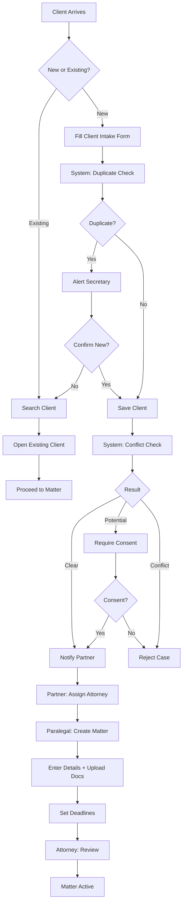

### 10.2 Document Approval

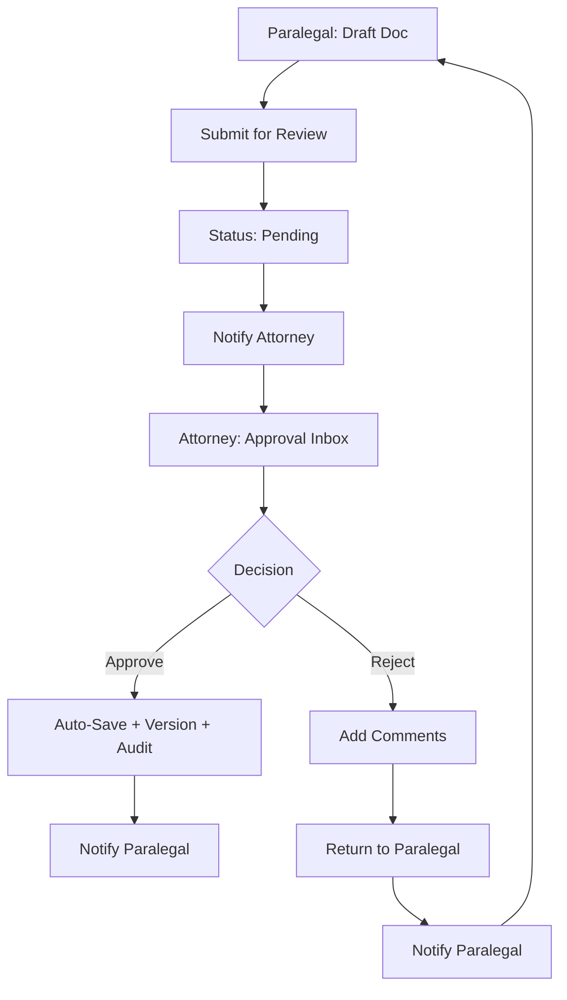

### 10.3 Time Tracking

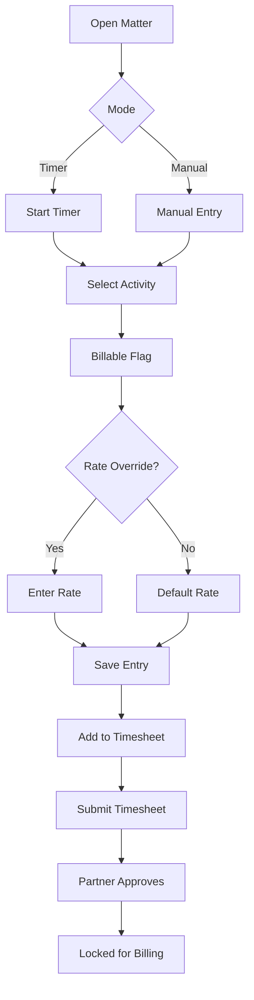

### 10.4 Billing & Invoicing

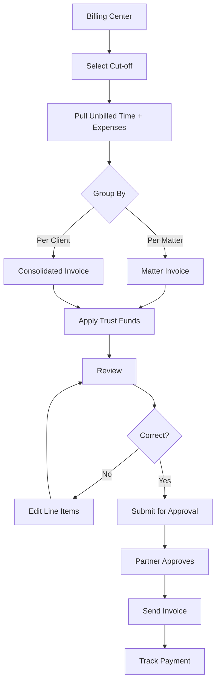

### 10.5 Trust Accounting

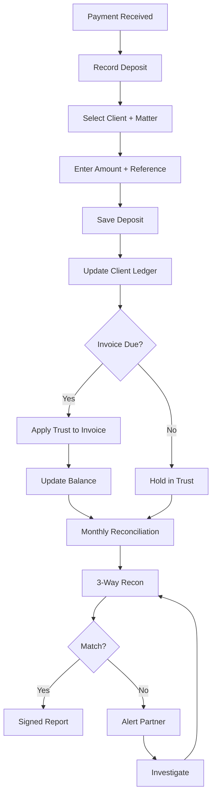

### 10.6 Conflict Check

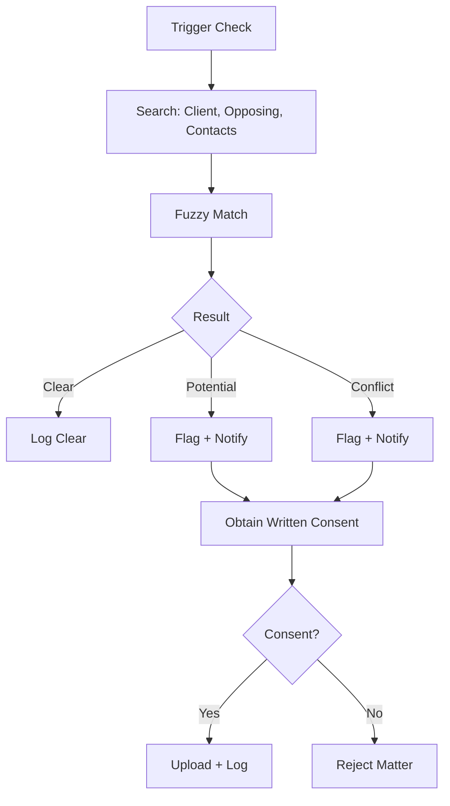

### 10.7 Matter Closure

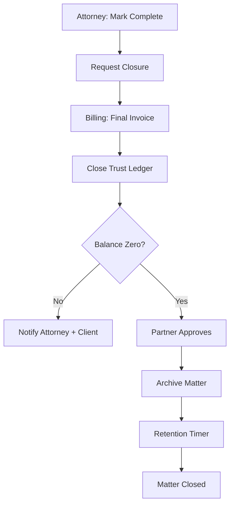

### 10.8 Delegation

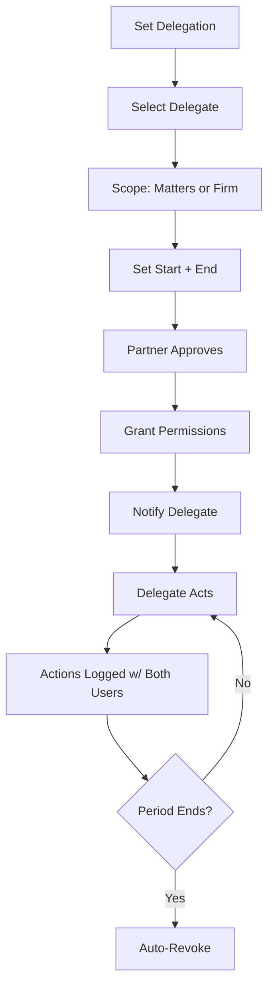

### 10.9 User Provisioning

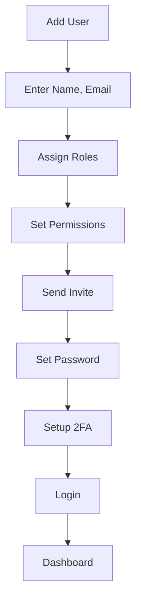

### 10.10 DSAR

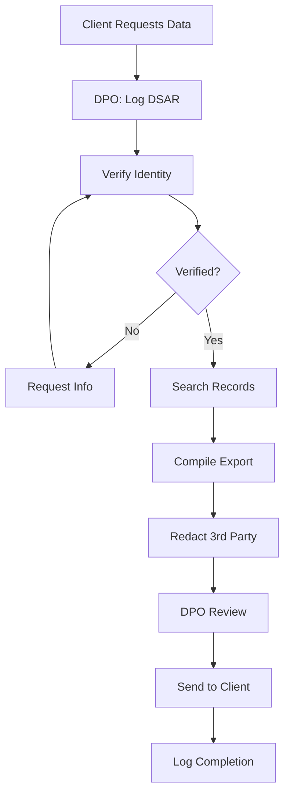

---

## 11. Sitemap / IA

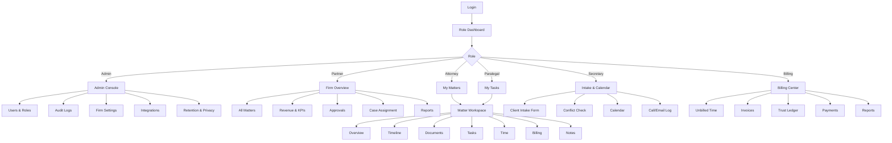

---

## 12. Wireframes

### 12.1 Login + 2FA
```
┌─────────────────────────────────────────┐
│            Juris Desk+                   │
│                                         │
│  ┌───────────────────────────────────┐  │
│  │  Email                            │  │
│  └───────────────────────────────────┘  │
│  ┌───────────────────────────────────┐  │
│  │  Password                         │  │
│  └───────────────────────────────────┘  │
│  ┌───────────────────────────────────┐  │
│  │         [ Sign In ]               │  │
│  └───────────────────────────────────┘  │
│                                         │
│  Forgot password?                       │
│                                         │
│  [ 2FA Screen ]                         │
│  Enter 6-digit code from authenticator  │
│  [ _ _ _ _ _ _ ]                        │
└─────────────────────────────────────────┘
```

### 12.2 Managing Partner Dashboard
```
┌──────────────────────────────────────────────────────────┐
│ Juris Desk+  [Search]           🔔 3   ⚙  👤 Maria Santos │
├──────────────────────────────────────────────────────────┤
│ [Firm] [Matters] [Approvals] [Reports] [Team]           │
├──────────────────────────────────────────────────────────┤
│ ┌─ KPI Cards ────────────────────────────────────────┐   │
│ │ Active Matters │ Revenue (MTD) │ Unpaid │ Overdue  │   │
│ │     47         │ ₱2,340,000    │  8     │   3      │   │
│ └────────────────────────────────────────────────────┘   │
│ ┌─ Approval Inbox ───────────┐ ┌─ Deadlines ─────────┐   │
│ │ 3 invoices pending         │ │ 5 hearings this wk  │   │
│ │ 7 documents pending        │ │ 2 filings due soon  │   │
│ │ [Review →]                 │ │ [View →]            │   │
│ └────────────────────────────┘ └─────────────────────┘   │
│ ┌─ Active Matters ───────────────────────────────────┐   │
│ │ M-2025-001 Dela Cruz vs Dela Cruz   RTC Br.12   ●  │   │
│ │ M-2025-002 People vs Reyes          MeTC Br.5   ●  │   │
│ │ M-2025-003 ABC Corp Labor           NLRC         ●  │   │
│ └────────────────────────────────────────────────────┘   │
└──────────────────────────────────────────────────────────┘
```

### 12.3 Attorney — My Matters
```
┌──────────────────────────────────────────────────────────┐
│ Juris Desk+  [Search]           🔔 5   ⚙  👤 Atty Rizal    │
├──────────────────────────────────────────────────────────┤
│ [My Matters] [Tasks] [Calendar] [Time] [Approvals]       │
├──────────────────────────────────────────────────────────┤
│ [+ Quick Time] [🔍 Filter: All ▾] [Sort: Deadline ▾]     │
├──────────────────────────────────────────────────────────┤
│ ┌─ Matter Card ───────────────────────────────────────┐  │
│ │ M-2025-001  Dela Cruz vs Dela Cruz                  │  │
│ │ RTC Br. 12 · Family Law · Open                      │  │
│ │ Next: Hearing Mar 15  ⏱ 12.5h MTD  💰 ₱31,250 MTD  │  │
│ │ Team: A.Reyes(Paralegal), L.Cruz(Sec)               │  │
│ │ [Open] [Log Time] [Docs]                            │  │
│ └──────────────────────────────────────────────────────┘ │
│ (repeat per matter)                                      │
└──────────────────────────────────────────────────────────┘
```

### 12.4 Matter Workspace
```
┌──────────────────────────────────────────────────────────┐
│ ← Back  M-2025-001  Dela Cruz vs Dela Cruz               │
│ Status: Open  ·  RTC Br. 12  ·  Family Law  ·  Atty Rizal│
├──────────────────────────────────────────────────────────┤
│ [Overview] [Timeline] [Documents] [Tasks] [Time] [Bill]  │
├──────────────────────────────────────────────────────────┤
│ OVERVIEW                                                 │
│ ┌─ Parties ─────────┐ ┌─ Key Dates ─────────────────┐    │
│ │ Plaintiff: J.DC   │ │ Filed: Jan 15, 2025          │    │
│ │ Defendant: M.DC   │ │ Hearing: Mar 15, 2025        │    │
│ │ Counsel: Firm     │ │ Pre-trial: Apr 2, 2025       │    │
│ └───────────────────┘ └──────────────────────────────┘    │
│ ┌─ Recent Activity ─────────────────────────────────┐    │
│ │ • Doc approved: Petition (Atty Rizal, 2h ago)     │    │
│ │ • Time logged: 1.5h research (A.Reyes, 4h ago)    │    │
│ │ • Task done: Client interview (L.Cruz, 1d ago)    │    │
│ └────────────────────────────────────────────────────┘   │
└──────────────────────────────────────────────────────────┘
```

### 12.5 Document Approval Inbox
```
┌──────────────────────────────────────────────────────────┐
│ Approvals Inbox                                          │
├──────────────────────────────────────────────────────────┤
│ [Documents: 7] [Invoices: 3] [Write-offs: 1]             │
├──────────────────────────────────────────────────────────┤
│ Pending Documents                                        │
│ ┌──────────────────────────────────────────────────────┐ │
│ │ ▸ Petition for Annulment v2                          │ │
│ │   M-2025-001 · Submitted by A.Reyes · 2h ago         │ │
│ │   [Preview] [✓ Approve] [✗ Reject with Comments]     │ │
│ └──────────────────────────────────────────────────────┘ │
│ ┌──────────────────────────────────────────────────────┐ │
│ │ ▸ Judicial Affidavit v1                              │ │
│ │   M-2025-002 · Submitted by A.Reyes · 5h ago         │ │
│ │   [Preview] [✓ Approve] [✗ Reject with Comments]     │ │
│ └──────────────────────────────────────────────────────┘ │
└──────────────────────────────────────────────────────────┘
```

### 12.6 Time Tracker (Floating)
```
┌─ Time Tracker ────────────────┐
│ Matter: M-2025-001 ▾          │
│ Activity: Legal research ▾    │
│ Billable: ● Yes ○ No ○ Pro bono│
│ Rate: ₱2,500/h (override)     │
│ Duration: 00:47:23            │
│ [⏸ Pause] [💾 Save] [✗ Cancel] │
└───────────────────────────────┘
```

### 12.7 Billing Center
```
┌──────────────────────────────────────────────────────────┐
│ Billing Center                                           │
├──────────────────────────────────────────────────────────┤
│ [Unbilled Time] [Invoices] [Trust Ledger] [Reports]      │
├──────────────────────────────────────────────────────────┤
│ Cut-off Period: [Feb 1 – Feb 29, 2025 ▾]  [Generate ▾]   │
│                                                          │
│ Unbilled Time — 34 entries · ₱127,500                    │
│ ┌─────────────────────────────────────────────────────┐  │
│ │ ☑ M-2025-001 Dela Cruz     12.5h  ₱31,250           │  │
│ │ ☑ M-2025-002 People Reyes   8.0h  ₱20,000           │  │
│ │ ☑ M-2025-003 ABC Corp      20.0h  ₱50,000           │  │
│ │ ☐ M-2025-004 Lim Collection 6.5h  ₱26,250           │  │
│ └─────────────────────────────────────────────────────┘  │
│                                                          │
│ [Generate Invoices for Selected]                         │
└──────────────────────────────────────────────────────────┘
```

### 12.8 Trust Ledger
```
┌──────────────────────────────────────────────────────────┐
│ Trust Ledger — Client: ABC Corporation                   │
├──────────────────────────────────────────────────────────┤
│ Balance: ₱450,000                                        │
├──────────────────────────────────────────────────────────┤
│ Date       │ Ref       │ Description    │ Dr     │ Cr    │
│ Feb 01     │ TR-001    │ Deposit        │        │ 500K  │
│ Feb 15     │ TR-008    │ Apply INV-001  │ 30K    │       │
│ Feb 20     │ TR-012    │ Deposit        │        │ 20K   │
│ Feb 28     │ TR-019    │ Apply INV-002  │ 40K    │       │
├──────────────────────────────────────────────────────────┤
│ [Reconcile] [Export]                                     │
└──────────────────────────────────────────────────────────┘
```

### 12.9 Admin Console — Users
```
┌──────────────────────────────────────────────────────────┐
│ Admin Console                                            │
├──────────────────────────────────────────────────────────┤
│ [Users] [Roles] [Firm Settings] [Audit] [Retention]      │
├──────────────────────────────────────────────────────────┤
│ [+ Add User]  [🔍 Search]                                 │
│ ┌──────────────────────────────────────────────────────┐ │
│ │ Name          │ Email          │ Roles        │ Act  │ │
│ │ Atty M.Santos │ m@firm.ph      │ MNG+ATT      │ ●    │ │
│ │ Atty J.Rizal  │ j@firm.ph      │ ATTORNEY     │ ●    │ │
│ │ A.Reyes       │ a@firm.ph      │ PARALEGAL    │ ●    │ │
│ │ L.Cruz        │ l@firm.ph      │ SECRETARY    │ ●    │ │
│ │ C.Garcia      │ c@firm.ph      │ BILLING      │ ●    │ │
│ │ R.Lim         │ r@firm.ph      │ SYS_ADMIN    │ ●    │ │
│ └──────────────────────────────────────────────────────┘ │
└──────────────────────────────────────────────────────────┘
```

---

## 13. Form Specifications

### 13.1 Client Intake Form

| Field | Type | Required | Validation | Notes |
|-------|------|:--------:|------------|-------|
| Client Type | Radio | ✅ | Individual / Corporation | |
| Full Name | Text | ✅ | 2–150 chars | Auto-title case |
| Company Name | Text | If corp | 2–200 chars | Conditional |
| TIN | Text | If corp | 9–12 digits | |
| DOB | Date | If ind. | Past date | |
| Email | Email | ✅ | Valid format | Duplicate check |
| Phone | Tel | ✅ | PH format | +63 |
| Address | Text | ✅ | 10–300 chars | |
| Case Type | Dropdown | ✅ | 1 of 10 matter types | |
| Urgency | Radio | ✅ | Low / Med / High | |
| Referral Source | Dropdown | — | | |
| Brief Description | Textarea | ✅ | 10–2000 chars | |
| Consent to Data Processing | Checkbox | ✅ | Must be checked | RA 10173 |
| ID Attachment | File | — | PDF/JPG/PNG | Optional |

**Actions:** `[Save & Run Conflict Check]` `[Save as Draft]` `[Cancel]`

### 13.2 Matter Creation Form

| Field | Type | Required | Notes |
|-------|------|:--------:|-------|
| Matter Title | Text | ✅ | Auto-suggest "X vs Y" |
| Client | Lookup | ✅ | From existing clients |
| Matter Type | Dropdown | ✅ | 10 types |
| Practice Area | Dropdown | ✅ | Litigation / Corporate / etc. |
| Court | Lookup | Conditional | Required for litigation |
| Case Number | Text | Conditional | |
| Parties | Repeater | ✅ | Role + Name |
| Assign Attorney | Lookup | ✅ | |
| Assign Paralegal | Lookup | — | |
| Assign Secretary | Lookup | — | |
| Billing Type | Dropdown | ✅ | Hourly/Flat/Contingency/Retainer/Pro Bono |
| Rate | Number | If hourly | ₱ |
| Contingency % | Number | If contingency | Max 25 |
| Filing Date | Date | — | |
| Next Hearing | Date | — | |
| Description | Textarea | — | |

**Actions:** `[Create Matter]` `[Save Draft]` `[Cancel]`

### 13.3 Document Upload Form

| Field | Type | Required |
|-------|------|:--------:|
| Title | Text | ✅ |
| Matter | Lookup | ✅ |
| Document Type | Dropdown | ✅ |
| Confidential | Checkbox | — |
| File | File | ✅ |
| Notes | Textarea | — |

### 13.4 Time Entry Form

| Field | Type | Required |
|-------|------|:--------:|
| Matter | Lookup | ✅ |
| Date | Date | ✅ |
| Activity | Text | ✅ |
| Duration | Duration | ✅ |
| Billable | Radio | ✅ |
| Rate | Number | If billable |
| Notes | Textarea | — |

### 13.5 Expense Form

| Field | Type | Required |
|-------|------|:--------:|
| Matter | Lookup | ✅ |
| Date | Date | ✅ |
| Category | Dropdown | ✅ |
| Amount | Number | ✅ |
| Billable | Checkbox | — |
| Receipt | File | — |
| Notes | Textarea | — |

### 13.6 Invoice Form

| Field | Type | Required |
|-------|------|:--------:|
| Client | Lookup | ✅ |
| Matter(s) | Multi-lookup | ✅ |
| Period | Date range | ✅ |
| Line Items | Auto-populated | ✅ |
| Trust Applied | Number | — |
| Discount | Number | — |
| Due Date | Date | ✅ |
| Notes | Textarea | — |

### 13.7 Conflict Check Form

| Field | Type | Required |
|-------|------|:--------:|
| Client Name | Text | ✅ |
| Opposing Party | Text | — |
| Opposing Counsel | Text | — |
| Related Contacts | Multi-text | — |

### 13.8 User Creation Form

| Field | Type | Required |
|-------|------|:--------:|
| Full Name | Text | ✅ |
| Email | Email | ✅ |
| Roles | Multi-select | ✅ |
| IBP Number | Text | If attorney |
| MCLE Expiry | Date | If attorney |
| Notarial Commission | Text | — |
| 2FA Required | Checkbox | ✅ |

---

## 14. Design System

### 14.1 Colors

| Token | Hex | Usage |
|-------|-----|-------|
| `--primary` | #1E3A8A | Brand, primary buttons |
| `--primary-hover` | #1E40AF | Hover |
| `--secondary` | #64748B | Secondary actions |
| `--success` | #16A34A | Approvals, paid |
| `--warning` | #F59E0B | Pending, at-risk |
| `--danger` | #DC2626 | Reject, overdue |
| `--info` | #0EA5E9 | Info badges |
| `--bg` | #F8FAFC | Page background |
| `--surface` | #FFFFFF | Cards |
| `--text` | #0F172A | Body text |
| `--text-muted` | #64748B | Secondary text |
| `--border` | #E2E8F0 | Borders |

### 14.2 Typography

| Token | Font | Size | Weight | Usage |
|-------|------|------|--------|-------|
| `h1` | Inter | 28px | 700 | Page title |
| `h2` | Inter | 22px | 600 | Section |
| `h3` | Inter | 18px | 600 | Card title |
| `body` | Inter | 14px | 400 | Body |
| `small` | Inter | 12px | 400 | Meta |
| `mono` | JetBrains Mono | 13px | 400 | IDs, numbers |

### 14.3 Spacing

4 / 8 / 12 / 16 / 24 / 32 / 48 / 64 px (scale: 4).

### 14.4 Components

Buttons (primary, secondary, danger, ghost), Input, Select, Checkbox, Radio, Toggle, Date picker, File upload, Table, Card, Modal, Drawer, Tabs, Badge, Tag, Tooltip, Toast, Notification bell, Avatar, Breadcrumb, Pagination, Empty state, Skeleton loader, Progress bar, Timeline, Stepper, Sidebar, Top bar, Approval inbox, Timer widget, Matter card, KPI card, Chart (line, bar, donut).

### 14.5 Status Badges

| Status | Color | Token |
|--------|-------|-------|
| Draft | Gray | secondary |
| Pending | Amber | warning |
| Approved | Green | success |
| Rejected | Red | danger |
| Active | Blue | primary |
| Closed | Slate | muted |
| Overdue | Red | danger |

### 14.6 Layout

- Desktop-first: 1440px reference
- Sidebar: 240px fixed
- Content: max 1280px centered
- Grid: 12 columns, 24px gutter
- Tablet: sidebar collapses
- Mobile: read-only MVP

---

## 15. Microcopy

### Buttons
- Primary: "Create Matter", "Save", "Submit for Review", "Approve", "Reject", "Send Invoice"
- Secondary: "Cancel", "Save Draft", "Preview", "Back"
- Danger: "Delete", "Archive", "Write Off"

### Empty States
- Matters: "No matters yet. Create one or wait for an assignment."
- Docs: "No documents uploaded. Drag files here to upload."
- Tasks: "You're all caught up."

### Errors
- Permission: "You don't have permission for this action. Contact your System Admin."
- Validation: "Please fill in all required fields."
- Conflict: "A potential conflict was found. Written informed consent is required before proceeding."
- Upload: "File too large. Maximum size is 50 MB."
- Session: "Your session expired. Please log in again."

### Confirmations
- Approve: "Approve this document? It will be saved to the matter and cannot be edited afterward."
- Reject: "Reject this document? The submitter will be notified with your comments."
- Delete: "Delete this item? This action can be undone within 30 days."
- Write-off: "Write off this amount? Only Managing Partners can approve write-offs."

### Tooltips
- Confidential: "Only assigned attorneys can view this document."
- Trust: "Client funds held in trust. Must be reconciled monthly."
- Pro Bono: "Recorded for CPRA compliance. Not billed to the client."

### Notifications
- Doc submitted: "New document awaiting your review."
- Doc approved: "Your document was approved."
- Deadline: "Hearing in 3 days for M-2025-001."
- Trust: "Trust balance for ABC Corp is below ₱50,000."

---

## 16. Accessibility

- Target: **WCAG 2.1 AA**
- Color contrast: 4.5:1 text, 3:1 UI
- Keyboard navigation: all actions reachable via Tab
- Focus indicators: visible
- Screen reader: ARIA labels, semantic HTML
- Forms: label association, error announcements
- Modals: focus trap, ESC to close
- Skip links: "Skip to main content"
- Text scaling: up to 200% without loss
- No color-only indicators (use icon + text)
- Reduced motion support
- Alt text required on images

---

## 17. Functional Requirements (Summary)

**Admin & Security:** User CRUD, multi-role, 2FA (Admin/Partner/Billing), 30-min timeout, 12-char passwords, audit log, firm profile.

**Client & Intake:** Client record, duplicate detection, intake form (case type + urgency + referral), attachments, status lifecycle.

**Conflict Check:** Search against clients/matters/contacts/opposing parties, fuzzy match, result (Clear/Potential/Conflict), consent upload, logged.

**Matter:** Unique ID, type-driven fields, team assignment, status lifecycle, timeline, matter-level permissions, delegation.

**Contacts:** Types (client, opposing party/counsel, court, prosecutor, expert, process server, notary), matter linking, history, PH court directory.

**Documents:** Upload (PDF/DOCX/XLSX/JPG/PNG, 50MB max), versioning, approval workflow, templates, full-text search, role-based access, confidential flag.

**Tasks & Calendar:** Task CRUD + assignment, recurring tasks, status flow, calendar (hearings/deadlines/meetings), deadline engine, reminders 30/15/7/3/1, sync (Phase 2).

**Time:** Timer + manual, activity, billable flag, rate override, timesheet, immutable once invoiced.

**Billing:** 5 types, rate modifiers, invoice generation, consolidated invoices, 25% contingency cap, write-off approval, status flow, payment recording.

**Trust:** Separate client ledgers, deposits/withdrawals/transfers, apply to invoices, 3-way reconciliation, low-balance alerts, export.

**Reports:** Role dashboards, KPIs, attorney productivity, aging receivables, pro bono report, conflict log, export.

**Search & Notifications:** Global search, filters, in-app + email, per-user config, digest.

**Data Privacy:** Consent capture, DSAR workflow, export, deletion with retention check, breach workflow, DPA, DPO designation.

---

## 18. Non-Functional Requirements

| Area | Requirement |
|------|-------------|
| Performance | Page <2s; API <500ms P95; 500 concurrent users/tenant |
| Availability | 99.9% uptime; 7-day maintenance notice |
| Scalability | Horizontal scaling; row-level tenant isolation |
| Security | RBAC, 2FA, AES-256 at rest, TLS 1.3 in transit, annual pen test |
| Compliance | RA 10173, CPRA, SC trust rules, IBP |
| Accessibility | WCAG 2.1 AA |
| Browsers | Chrome, Edge, Firefox, Safari (last 2) |
| Responsive | Desktop-first; tablet-supporting; mobile read-only |
| Localization | English primary; Filipino (Phase 2) |
| Backup | Daily full + hourly incremental; 30-day retention |
| DR | RTO 4h, RPO 1h |
| Auditability | Immutable logs; sensitive actions logged |
| Data Residency | PH-based data center |

---

## 19. Integrations

| Integration | MVP | Phase 2 |
|-------------|:---:|:-------:|
| Email (SMTP/API) | ✅ | |
| Cloud Storage (S3/GCS) | ✅ | |
| Outlook Calendar | ⬜ | ✅ |
| Google Calendar | ⬜ | ✅ |
| DocuSign / Adobe Sign | ⬜ | ✅ |
| Payment Gateway | ⬜ | ✅ |
| eCourt / e-Subpoena | ⬜ | ✅ |
| QuickBooks / Xero | ⬜ | ✅ |
| SMS Gateway | ⬜ | ✅ |

---

## 20. Data Model (High-Level)

**Entities:**
- `Tenant`, `User`, `Role`, `Permission`, `UserRole`
- `Client`, `Matter`, `Contact`, `MatterContact`
- `Document`, `DocumentVersion`, `DocumentApproval`
- `Task`, `CalendarEvent`
- `TimeEntry`, `Expense`
- `Invoice`, `InvoiceLineItem`, `Payment`
- `TrustAccount`, `TrustTransaction`, `ClientLedger`
- `ConflictCheck`, `ConsentRecord`
- `AuditLog`, `Notification`, `DSARRequest`, `RetentionPolicy`

**Key Relationships:**
- Tenant → Users, Clients, Matters, Documents (all tenant-scoped)
- Client → Matters (1:N)
- Matter → Documents, Tasks, TimeEntries, Expenses, Invoices (1:N)
- User ↔ Roles (M:N)
- Role ↔ Permissions (M:N)
- Matter ↔ Contacts (M:N)
- TrustAccount → ClientLedgers (1:N)

---

## 21. Seed Data

### Users
| ID | Name | Roles | Email |
|----|------|-------|-------|
| USR-001 | Atty. Maria Santos | MNG_PARTNER, ATTORNEY | maria@firm.ph |
| USR-002 | Atty. Jose Rizal | ATTORNEY | jose@firm.ph |
| USR-003 | Ana Reyes | PARALEGAL | ana@firm.ph |
| USR-004 | Liza Cruz | SECRETARY | liza@firm.ph |
| USR-005 | Carlo Garcia | BILLING | carlo@firm.ph |
| USR-006 | Rafael Lim | SYS_ADMIN | rafael@firm.ph |

### Clients
| ID | Name | Type | Case Type |
|----|------|------|-----------|
| CL-001 | Juan Dela Cruz | Individual | Family Law |
| CL-002 | ABC Corporation | Corporation | Corporate |
| CL-003 | Pedro Reyes | Individual | Criminal |
| CL-004 | Spouses Lim | Individual | Civil |

### Matters
| ID | Client | Title | Type | Attorney | Status |
|----|--------|-------|------|----------|--------|
| M-2025-001 | CL-001 | Dela Cruz vs Dela Cruz | Family Law | USR-002 | Open |
| M-2025-002 | CL-003 | People vs Reyes | Criminal | USR-002 | Open |
| M-2025-003 | CL-002 | ABC Corp Labor Case | Labor | USR-001 | Open |
| M-2025-004 | CL-004 | Lim Collection Case | Civil | USR-002 | Open |

### Documents
| ID | Matter | Title | Status | Version |
|----|--------|-------|--------|---------|
| DOC-001 | M-2025-001 | Petition for Annulment | Pending Review | v2 |
| DOC-002 | M-2025-002 | Judicial Affidavit | Pending Review | v1 |
| DOC-003 | M-2025-003 | Position Paper | Approved | v3 |

### Time Entries
| ID | Matter | User | Activity | Duration | Billable |
|----|--------|------|----------|----------|----------|
| TE-001 | M-2025-001 | USR-002 | Client consultation | 1.5h | Yes |
| TE-002 | M-2025-001 | USR-003 | Legal research | 3.0h | No |
| TE-003 | M-2025-002 | USR-002 | Court appearance | 2.0h | Yes |

### Invoices
| ID | Client | Amount | Status | Trust Applied |
|----|--------|--------|--------|---------------|
| INV-001 | CL-002 | ₱50,000 | Unpaid | ₱30,000 |
| INV-002 | CL-001 | ₱31,250 | Draft | — |

### Billing Types in Demo
- Hourly: ₱2,500 (Attorney), ₱1,500 (Paralegal)
- Flat Fee: ₱50,000 (SEC Registration)
- Contingency: 25% of recovery (Collection case)
- Retainer: ₱100,000/month (ABC Corp)
- Pro Bono: Dela Cruz annulment

---

## 22. Demo Script

### Scenario 1 — New Client Walks In
1. Login as **Liza Cruz (Secretary)** → Intake & Calendar
2. Fill Client Intake Form (new walk-in client)
3. Submit → duplicate check passes → conflict check triggered
4. Switch to **Rafael Lim (Admin)** → Conflict Check → result: Clear
5. Switch to **Maria Santos (Partner)** → Assign Attorney (Jose Rizal)
6. Switch to **Ana Reyes (Paralegal)** → Create Matter → upload docs → set deadlines
7. Switch to **Jose Rizal (Attorney)** → Review matter

**Time:** ~3 min. **Shows:** intake, conflict, assignment, matter creation, permissions.

### Scenario 2 — Document Approval
1. Login as **Ana Reyes (Paralegal)** → Matter M-2025-001 → Documents
2. Draft new document → Submit for Review → status: Pending
3. Switch to **Jose Rizal (Attorney)** → Approval Inbox → Preview → Approve
4. Show version history + audit stamp
5. Reject another doc with comments → show paralegal notification

**Time:** ~2 min. **Shows:** workflow, permissions, versioning, audit.

### Scenario 3 — Time Tracking → Billing
1. Login as **Jose Rizal (Attorney)** → Open matter → Time Tracker → log 1.5h billable
2. Switch to **Carlo Garcia (Billing)** → Unbilled Time → select entries → Generate Invoice
3. Apply trust funds → Submit for Approval
4. Switch to **Maria Santos (Partner)** → Approve Invoice → Send
5. Switch to **Carlo** → Record payment → update ledger

**Time:** ~3 min. **Shows:** time, billing, trust, approval, multi-role handoff.

### Scenario 4 — Permission Demo
1. Login as **Ana Reyes (Paralegal)** → try Billing tab → disabled with tooltip
2. Switch to **Jose Rizal (Attorney)** → Billing tab hidden
3. Switch to **Carlo Garcia (Billing)** → only financial screens visible
4. Switch to **Rafael Lim (Admin)** → full access

**Time:** ~1 min. **Shows:** RBAC enforcement at UI.

### Scenario 5 — Dashboards
1. Login as **Maria Santos** → Firm Overview KPIs
2. Login as **Jose Rizal** → My Matters + upcoming hearings
3. Login as **Carlo Garcia** → Unbilled time + aging receivables

**Time:** ~1 min. **Shows:** role-tailored dashboards.

---

## 23. MVP vs Phase 2

### MVP
- Multi-tenant SaaS foundation
- RBAC, users, roles
- Client intake + duplicate check
- Conflict check + consent
- Matter management (10 types)
- Contacts directory
- Document upload, versioning, approval
- Tasks, calendar, deadline engine
- Time tracking (billable / non-billable / pro bono)
- Expenses
- Billing (5 types)
- Invoicing
- Trust accounting + 3-way reconciliation
- Approvals inbox
- Reports & dashboards
- Audit log
- Notifications
- Data privacy tooling (consent, DSAR, retention)

### Phase 2
- Client portal
- E-signature
- Payment gateway
- E-filing
- AI document review
- Mobile app
- Advanced BI
- Workflow builder
- Multi-language

---

## 24. Success Metrics

| Metric | Baseline | Target | Timeframe |
|--------|----------|--------|-----------|
| % matters in-platform | 0% | 90% | 90 days |
| Billable hours per attorney | TBD | +15% | 6 months |
| Invoice cycle time | TBD | <7 days | 3 months |
| Missed deadlines | TBD | 0 | Ongoing |
| Unauthorized access incidents | 0 | 0 | Ongoing |
| User adoption (DAU/WAU) | 0 | >70% | 90 days |
| Conflict checks logged | 0 | 100% of new matters | Ongoing |
| Pro bono hours tracked | Manual | 100% in-platform | 6 months |

---

## 25. Risks & Mitigations

| # | Risk | Impact | Probability | Mitigation |
|---|------|--------|-------------|------------|
| 1 | Low user adoption | High | Medium | Champions; training; simple UX |
| 2 | Data migration from Excel/Word | High | High | Phased migration; validation |
| 3 | Trust accounting errors | Critical | Medium | 3-way recon; audit log; training |
| 4 | Conflict check false negatives | Critical | Low | Fuzzy match; manual override + log |
| 5 | Data privacy breach | Critical | Low | Encryption; pen test; DPO; playbook |
| 6 | Scope creep | Medium | High | MVP freeze; change control |
| 7 | Integration failure | Medium | Medium | API contracts; sandbox |
| 8 | Multi-tenant data leak | Critical | Low | Row-level isolation; pen test |
| 9 | Compliance rule changes | Medium | Medium | Configurable rules; legal review |
| 10 | Performance at scale | Medium | Medium | Load testing; horizontal scaling |

---

## 26. Assumptions & Constraints

### Assumptions
1. Firms have basic internet and modern browsers.
2. Data migration from Excel/Word/PDF is phased.
3. Firms designate a DPO (RA 10173).
4. Attorneys log time daily.
5. Billing runs monthly cut-offs.
6. PH court deadline rules stable during MVP.
7. Platform Admin provisions tenants.
8. Data residency PH-based.

### Constraints
- Design phase first — no dev until UX sign-off.
- MVP timeline TBD.
- Budget TBD.
- Team: BA/UX lead for design; dev TBD.
- PH compliance non-negotiable.
- Multi-tenant single codebase.

---

## 27. Open Questions

| # | Question | Owner | Status |
|---|----------|-------|--------|
| 1 | Retention period per matter type? | Legal | Open |
| 2 | Data residency: PH-only or PH+? | Compliance | Open |
| 3 | Who is DPO per tenant? | Client | Open |
| 4 | Payment gateway vendor (P2)? | Product | Open |
| 5 | E-signature vendor (P2)? | Product | Open |
| 6 | Default rate card per firm? | Client | Open |
| 7 | Court holiday calendar source? | Product | Open |
| 8 | Billing cut-off schedule? | Client | Open |
| 9 | Multi-currency support? | Client | Open |
| 10 | Notarial register integration? | Product | Open |

---

## 28. Approval & Change Log

### Approval

| Role | Name | Signature | Date |
|------|------|-----------|------|
| Managing Partner | | | |
| Compliance Officer | | | |
| BA/UX Lead | | | |
| Platform Admin | | | |

### Change Log

| Version | Date | Author | Change |
|---------|------|--------|--------|
| 1.0 | 2025-01-XX | BA/UX Lead | Initial consolidated master doc (PRD + all design-phase artifacts) |

---

**End of Master Document**

---

This is now a **single, comprehensive, handoff-ready master document** covering everything from business requirements through design system, seed data, and demo script.

**Next steps:**
1. **Review** this document — flag anything to revise.
2. **Answer the 10 open questions** (Section 27).
3. Then we move to **live UI scaffold** — React + Vite + Tailwind + MSW with role switcher and seeded data.

